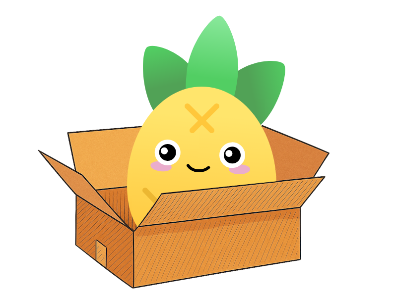

# pinia-plugin-storage

🍍 A comprehensive state persistence and synchronization, yet as simple as it can be

Main Features:

- **Multi-Adapter Support**: localStorage, sessionStorage, cookies, and indexedDB

- **Selective Persistence**: Include/exclude specific state properties

- **Multiple Buckets**: Different parts of state can use different storage adapters

- **Automatic Hydration**: Restores state from storage on app initialization

- **Real-time Synchronization**: Syncs state changes across browser tabs/windows

- **Debounced Persistence**: Configurable debouncing to optimize write performance

- **Namespace & Versioning**: Prevents storage key collisions and supports data migration

- **State Transformation**: Before/after hooks for data transformation during hydration

- **SSR Safe**: Server-side rendering compatible with environment detection

- **Error Handling**: Comprehensive error handling with custom error callbacks

## Getting started

### Installation

```sh
# or pnpm or yarn
npm install pinia-plugin-storage
```

### Usage (Basic)

1. Import plugin into `main.ts`

```ts
import { createApp } from 'vue'
import { createPinia } from 'pinia'
import { createPiniaPluginStorage } from 'pinia-plugin-storage'

import App from './App.vue'

const app = createApp(App)

const pinia = createPinia()
pinia.use(createPiniaPluginStorage)
app.use(pinia)

app.mount('#app')

```

2. Apply to your stores

```ts
import { ref } from 'vue'
import { defineStore } from 'pinia'

export const useCounterStoreBasic = defineStore('counter-basic', () => {
  const count = ref(0)

  const extCount = ref({
    decimal: 0,
    hex: '0x0',
  })

  function increment(incrementBy?: number) {
    count.value += incrementBy ?? 1

    extCount.value.decimal = count.value
    extCount.value.hex = '0x' + count.value.toString(16)
  }

  return { count, extCount, increment }
},{
    storage: 'localStorage'
})

```

3. Enjoy

```vue
<script setup lang="ts">
import { useCounterStoreBasic } from './stores/counter-basic'
const counterStoreBasic = useCounterStoreBasic()

const reloadPage = () => window.location.reload()
</script>

<template>
  <h1>Pinia Plugin Storage</h1>
  <button @click="counterStoreBasic.increment(1)">Increment</button>
  <p>Count: {{ counterStoreBasic.count }} | {{ counterStoreBasic.extCount }}</p>
  <hr />
  <p>Values should persist after page reload and value should be seen in browser's localStorage</p>
  <button @click="reloadPage">Reload Page</button>
</template>

```

### Usage (Advanced)

Check the full [documentation](./docs/README.md)

## Contributing

Contributions are welcomed! Please read our [Contributing Guide](./CONTRIBUTING.md) for details on how to get started.

## Credits

- [pinia-plugin-persistedstate](https://github.com/prazdevs/pinia-plugin-persistedstate)
- [pinia-plugin-persistedstate-2](https://github.com/soc221b/pinia-plugin-persistedstate-2)
- [pinia-plugin-persist](https://github.com/Seb-L/pinia-plugin-persist)

## License

This project is licensed under the MIT License - see the [LICENSE](/LICENSE) file for details
